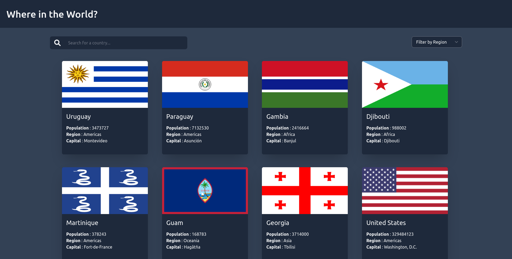

# Frontend Mentor - REST Countries API with color theme switcher solution

This is a solution to the [REST Countries API with color theme switcher challenge on Frontend Mentor](https://www.frontendmentor.io/challenges/rest-countries-api-with-color-theme-switcher-5cacc469fec04111f7b848ca). Frontend Mentor challenges help you improve your coding skills by building realistic projects. 

## Table of contents

- [Overview](#overview)
  - [The challenge](#the-challenge)
  - [Screenshot](#screenshot)
  - [Links](#links)
- [My process](#my-process)
  - [Built with](#built-with)
  - [Useful resources](#useful-resources)
- [Author](#author)

## Overview

### The challenge

Users should be able to:

- See all countries from the API on the homepage
- Search for a country using an `input` field
- Filter countries by region
- Click on a country to see more detailed information on a separate page
- Toggle the color scheme between light and dark mode *(optional)*

### Screenshot

### Links

- Project URL: [Project Repo](https://github.com/otienotimothy/rest-countries.git)
- Live Site URL: [Rest Countries](https://new-rest-countries.netlify.app/)

## My process

### Built with

- [React](https://reactjs.org/) - JS library
- [React-Query](https://react-query.tanstack.com/) - Data Synchronization Tool
- [Tailwindcss](https://tailwindcss.com/) - For styles

### Useful resources

- [React Query Docs](https://react-query.tanstack.com/overview) - This helped me get up and running quickly with react query.

## Author

**Timothy Otieno**
- Frontend Mentor - [@otienotimothy](https://www.frontendmentor.io/profile/otienotimothy)
- Twitter - [@iamtimlord](https://twitter.com/iamtimlord)

